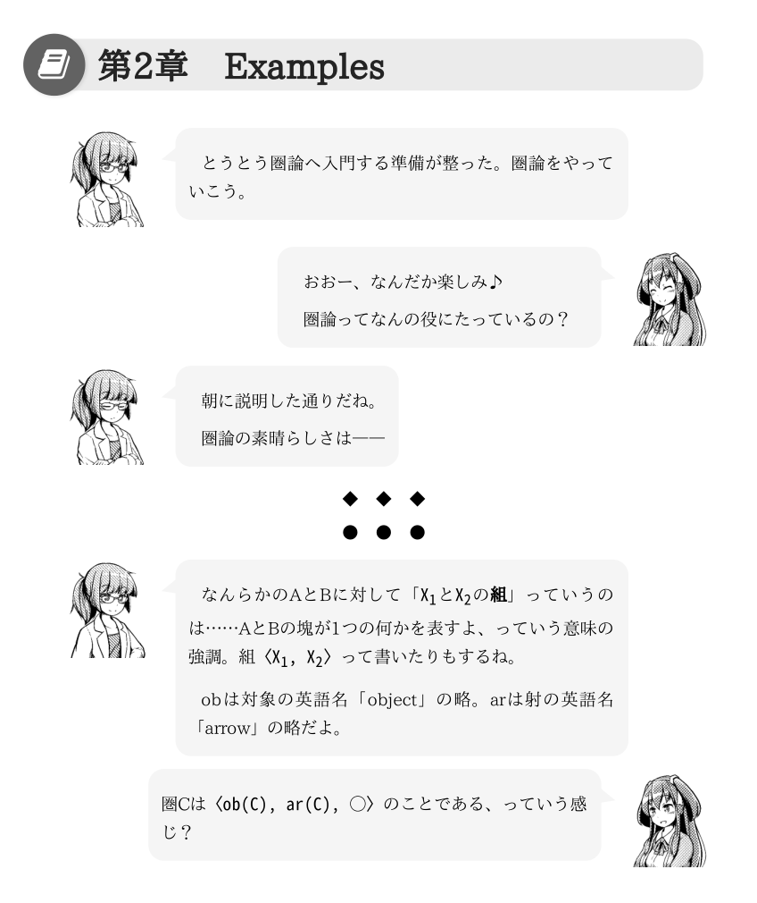

# 「せつラボ」テンプレート

「せつラボ」シリーズの初期環境です。


## ライセンス

- オリジナル: [MIT](./LICENSE.org)

- 本リポジトリ（cover.pngを除く）: [MIT](./LICENSE)
- ただし次のファイルは、いかなる利用もお控えください
    - `./cover.png`
    - `./articles/images/**/*` （imageディレクトリ内のすべて）

## 「せつラボ」シリーズについて

下記でそれぞれ販売中です。

- [せつラボ ～圏論の基本～ - とらのあな全年齢向け通販](https://ec.toranoana.shop/tora/ec/item/040030721516)
- [せつラボ 〜圏論の基本〜 - BOOTH](https://aiya000.booth.pm/items/1298622)
- [せつラボ ～圏論の基本～ （物理書籍） - BOOTH](https://aiya000.booth.pm/items/1316747)

## 追加要素

本リポジトリは[__at-grandpa/review-and-css-typesetting__](https://github.com/at-grandpa/review-and-css-typesetting)のフォークです。

オリジナルに比べ、次の機能が追加されています。

- 無理やりなB5対応
    - [./scripts/pdf.js](./scripts/pdf.js)

- [./articles/review-ext.rb](./articles/review-ext.rb) & [./articles/style.css](./articles/style.css)
    - 新規ブロック
        - talkleft
        - talkright
        - attention
        - romanlist
        - charintro
        - list
    - 新規シングル
        - focus
    - 新規インライン
        - mathcode
        - rubycode

### Examples



- talkleft
- talkright

```review
//talkleft[eta-arms]{
とうとう圏論へ入門する準備が整った。
圏論をやっていこう。
//}

//talkright[mu-smile]{
おおー、なんだか楽しみ♪

圏論ってなんの役にたっているの？
//}

//talkleft[eta-thinking]{
朝に説明した通りだね。

圏論の素晴らしさは――
//}
```

- mathcode

```review
//talkleft[eta]{
なんらかのAとBに対して「AとBの@<b>{組}」っていうのは……
AとBの塊が1つの何かを表すよ、っていう意味の強調。
組@<mathcode>{〈A, B〉}って書いたりもするね。

obは対象の英語名「object」の略。
arは射の英語名「arrow」の略だよ。
//}

//talkright[mu-saying]{
圏Cは@<mathcode>{〈ob(C), ar(C), ○〉}のことである、っていう感じ？
//}
```
